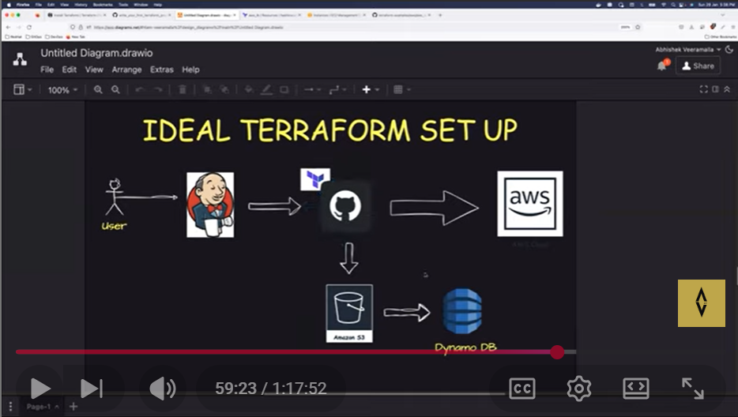

# Devops

learning Devops

day 4 - virtual machines

improve efficiency using automation like using terraforms and ansabals
using AWS EC2 api call u can make automation

valid
authenticated
authorized

for working of the api key aws will check

now write scripts using AWS cli or python and terraform and also AWS CDK
cloud development kit

Day-5 | AWS CLI Full Guide | How to connect to EC2 Instance from UI & Terminal | AWS CFT walk though

ssh ubuntu@ip_address
denies
ssh -i "ur pemfile path" ubuntu@ip_address
denies
chmod 600 "ur file path"

learn boto 3

Day-6 | Linux & Shell Scripting | Complete Shell Scripting Playlist| #aws #azure | #devops

architecture of Linux

I) kernal-heart if the os connecting hardware to software device managent,memory,process,handling system modules

II) system libraries libc

III) compilers - userprocess - system softwares

FUNDAMENTALS OF SHELL SCRIPTING OR COMMANDS

1>ls
2>cd
3>pwd
4>cd ..
5>cd ../..
6>ls -ltr - for checking if its directory or file
7>touch - creating a new file
8>vi "filename" - creates and writes in vi editor
for writing click -> esc -> i -> write the content then -> :wq -> enter to exit
9>cat - to print or view the file
10>mkdir
11>rm - removing the file
12>rm -r - removing the directory
13>free - to check the ram details
14>free -g - to check propely
15>nproc - only ram
16>df -h - to check the disk
17>top - to completely check

---

Day-7 | Live AWS Project using SHELL SCRIPTING for DevOps | AWS DevOps project


out put

so in this way we are getting a lots of output but we want only some instance id thing
so we use { jq and yq } jq for json format and yq for yml format to simply get what we need

aws ec2 describe-instances --query "Reservations[].Instances[].InstanceId" --output text #this only lists the instance id

---

in this project i wrote a simple shell script to Listing users with read access

Day 8

GitHub docs how to integrate GitHub repo using GitHub api and using in shell scripts to ease the work

task 1 basic - what devops engineer will be doing is they create GitHub repos and manage proper access to developers

- after this u wanna list the ppl and see who has acces now listing it using shell grant and revoke
- so to do this in gui u enter passeord and user name but to do in the cli u don't use it u use [ api token ]

  HOW TO GET THE API TOKEN

go to repo setting and navigate to developer role or access and click generate a new token there u have it

after this pre-required thig to do is

export username="tarun08-code"
export token="your_token"

OK NOW TO RUN THE SHELL SCRIPT

./shellscript.sh org_name repo_name

if the permission is denied
use
chmod 777 shellscript.sh

again run the shell script

INSTALLING THE JQ OR YQ

sudo apt install jq -y

shell code -------------------------------------------------------------------------------------------------
check the p2-github-api folder for script



------------------------------------------------------------------------------------------------

Day 9 

git and github complete whivh i already know 

day 10 

branching and git again

day 11

Day-11 | Git Interview Q&A and Commands for DevOps | Real World Example 

adding ssh key to my github 

location -   /c/Users/Dineshtarun G/.ssh/id_rsa.pub

Day 12 | Deploy and expose your First App to AWS | Feat. Kunal Verma | Live Project | #aws projects

---------------------------------------------------------------------------------------------------

deployed the app 

Day 13 | Top 15 AWS Services that Every DevOps Engineers should learn |

-----------------------------------------------------------------------------------------------------

aws services that i should learn as a devops engineer 

1 .EC2 
2. VPC
3 . EBS 
4. S3 
5. IAM 
6. CLOUD WATCH 
7. LAMDA 

8. CLOUD  BUILD SERVICE  -  AWS version = CodeBuild.
Pulls code → installs deps → tests → builds → outputs artifacts. CI/CD

9. AWS CONFIGURATION  -  Setting up AWS resources and environment (VPC, EC2, IAM, S3, etc.) so your system runs smoothly.

10. BILLING AND COSTING
11. AWS KMS
12. CLOUD TRAIL  -  Stores the logs of api things 

                  AWS CloudTrail = CCTV camera for your AWS account.

It records every action done in AWS, like:

Who created EC2?

Who deleted an S3 bucket?

Who changed IAM policies?

When did someone log in?

Basically, logs every API call happening in your AWS account.


13 .AWS EKS      -  Amazon Elastic Kubernetes Service (EKS) like kubernetes 
    AWS ECS      -  elastic contanarization service like awsw will manage all the containers no kubernetes no           tension 
14. FORGATE 
15. ELK STACK    - ELK = Elasticsearch + Logstash + Kibana 

                    Logstash → Collect logs

                    Elasticsearch → Store + search logs

                    Kibana → Visualize logs

Day-14 | Configuration Management With Ansible |Puppet vs Ansible |Live Projects | #ansible #devops

-------------------------------------------------------------------------------------------------------------------

Notes of this video-

Scenario- System admin has to configure 100s of servers, each with different OS like Ubuntu, CentOS, Windows.
Tasks include updating OS, security patches, default installations like git, databases on servers. 

Issue- Doing this manually on every server is difficult. Hence, scripts were used. Powershell scripts for windows machines, other shells for Linux machines. Even in Linux machines, scripts varied based Linux flavours and type of script (bash, zsh, tsh, etc). This script will then loop over all servers to perform configuration tasks.

With cloud and micro service architecture adoption, number of servers have increased further. 

Hence, even scripting approach is not very efficient. This led to concept of configuration management. Various tools are used for configuration management. Puppet and Chef were pioneering tools while Ansible, developed by Red Had is most popular.

Why Ansible over Puppet?
	1. Puppet = Pull mechanism, Ansible= Push mechanism. Eg. Managing 10 EC2- Write ansible playbook and push to all 10 EC2
	2. Puppet uses Master-Agent architecture- Have to create Master server and configure all 10 EC2 as agents. Ansible is agentless. Write only ip/dns of machine in inventory file and have passwordless authentication enabled. In case of dynamic demand, auto-scaling is possible by changing inventory file. Even better- 'Dynamic Inventory' feature auto detects demand- doing away need to change inventory file.
	3. Support for Windows is better in Ansible than Puppet
	4. Ansible Playbook is written in YAML which is widely used. Puppet configuration is written in Puppet language.
	
	
Issues with Ansible
	1. Support for Windows is still not seamless
	2. Debugging is not easy. Can run ansible in debug mode but debugging logs are not easy to understand.
	3. Performance issues- when managing thousands of servers


Configuration Management & Ansible - Summary Notes

What is Configuration Management?

Purpose: Managing configuration of multiple servers (upgrades, security patches, installations)
Problem it solves: Manual management of hundreds/thousands of servers is extremely difficult and time-consuming
Traditional approach: Writin g shell scripts (Linux) or PowerShell scripts (Windows) - complex and distribution-dependent
Why Configuration Management Tools?
Cloud era challenges:
10x increase in number of servers
Microservices architecture = more servers with smaller configurations
Dynamic scaling (up/down) based on demand
Need: Automated tool to manage configurations across multiple servers regardless of OS/distribution
Popular Configuration Management Tools
Puppet
Chef
Ansible (most widely used)
Salt
Why Ansible is the Winner?
1. Push vs Pull Model
Ansible: Push model - write playbooks on laptop, push configuration to servers
Puppet: Pull model - servers pull configuration from master
2. Agentless Architecture
Ansible: No agent installation needed, just IP address in inventory file + passwordless authentication
Puppet/Chef: Requires Master-Slave setup with agents on each server
3. Better Windows & Linux Support
Uses SSH for Linux
Uses WinRM for Windows
Good module support for both platforms
4. Simple YAML Syntax
Ansible uses YAML (widely known language)
Puppet requires learning proprietary Puppet language
5. Dynamic Inventory
Auto-detects new servers in AWS/cloud
No manual inventory file updates needed
Ansible Disadvantages
Windows support still needs improvement
Debugging capabilities could be better
Performance issues with 10,000+ servers
Key Interview Questions & Answers
Programming language? Python (for writing modules), YAML (for playbooks)
Supports Windows & Linux? Yes - SSH for Linux, WinRM for Windows
Push or Pull? Push mechanism
Cloud provider support? Works with all clouds (AWS, Azure, GCP) - only needs public IP and SSH access
Why Ansible over Puppet/Chef? Agentless, push model, YAML syntax, easier to use
Additional Features
Ansible Galaxy: Share custom modules with community
Custom modules: Write your own using Python
Extensible: Contribute to open-source enhancement

Day-15 | Ansible Zero to Hero

# Ansible Tutorial Summary

This is **Day 15 of a DevOps course** focusing on practical Ansible implementation (following Day 14's theory).

## Key Topics Covered

### 1. **Installation & Setup**
- Install Ansible on Ubuntu using: `sudo apt update` then `sudo apt install ansible`
- Verify installation: `ansible --version`
- Use package managers (apt, brew, chocolatey) rather than pip for easier setup

### 2. **Passwordless Authentication**
- Generate SSH keys: `ssh-keygen`
- Copy public key from Ansible server to target server's `authorized_keys` file
- This enables Ansible to communicate with target servers without passwords

### 3. **Ansible Ad-Hoc Commands**
- For simple, one-off tasks (no playbook needed)
- Syntax: `ansible -i inventory all -m shell -a "touch devops_class"`
- Use `-m` for module, `-a` for arguments
- Examples: creating files, checking disk usage, running shell commands

### 4. **Inventory File**
- Stores target server IP addresses
- Can group servers (e.g., `[web_servers]`, `[db_servers]`)
- Allows selective execution on specific server groups

### 5. **Ansible Playbooks**
- For multiple tasks requiring structured execution
- Written in YAML format
- Example: Installing and starting Nginx
- Use `ansible-playbook -i inventory playbook.yaml` to execute
- Add `-vvv` for verbose debugging output

### 6. **Ansible Roles**
- For complex, structured playbooks (e.g., Kubernetes setup)
- Create with: `ansible-galaxy role init <role_name>`
- Organized structure: tasks, handlers, templates, files, vars, defaults, meta
- Makes large playbooks maintainable and reusable

**Best Practice**: Use Terraform for infrastructure creation, Ansible for configuration management.
---------------------------------------------------------------------------------------------------
Day-16 | Infrastructure as Code | #terraform #IaC


# Video Summary: Infrastructure as Code & Terraform

This is **Day 16 of a DevOps course** focusing on Infrastructure as Code (IaC) concepts.

## Key Problems Identified

**Scenario**: A DevOps engineer at Flipkart needs to manage 300 applications across different cloud platforms.

**The Challenge**:
- Each cloud provider has its own automation tool (AWS CFT, Azure Resource Manager, OpenStack Heat Templates)
- Migrating between providers requires rewriting hundreds of scripts
- Organizations increasingly use **hybrid cloud** models, requiring knowledge of multiple tools simultaneously

## The Solution: Terraform

**What Terraform offers**:
- **One tool** to automate infrastructure across multiple cloud providers
- Uses **API as Code** concept - converts Terraform scripts into provider-specific API calls
- Smooth migration between cloud providers with minimal code changes
- No need to learn provider-specific tools (CFT, ARM, Heat Templates, etc.)

## Core Concepts Explained

1. **Infrastructure as Code (IaC)**: Automating infrastructure using code instead of manual processes
2. **API as Code**: Terraform's approach - write once in Terraform language, and it handles communication with any cloud provider's API

**Bottom line**: Instead of learning AWS CFT, Azure ARM, and other provider-specific tools, learn Terraform once and automate across all platforms.

Day-17 |Everything about Terraform |Write Your First Project |Remote Backend |Modules |Interview Q&A

# Terraform Tutorial Summary

This comprehensive video covers Terraform from basics to advanced concepts. Here's what you'll learn:

## Key Topics Covered

### *Basics & Installation*
- What Terraform is and why it's better than cloud-specific tools (AWS CloudFormation, Azure ARM)
- Installation on Mac, Linux, Ubuntu, and CentOS
- Core commands: `terraform init`, `plan`, `apply`, `destroy`

### *Writing Terraform Files*
- *Provider configuration* - Setting up AWS/Azure providers
- *Resource blocks* - Creating infrastructure (EC2, S3, DynamoDB)
- *Best practices* - Using `input.tf` and `output.tf` for variables
- HashiCorp documentation as the primary reference

### *State File Management* (Critical Topic)
- State files track all infrastructure changes
- *Never store state files locally or in Git* - contains sensitive data
- *Remote backends* - Use S3 bucket for state storage
- *DynamoDB locking* - Prevents parallel execution conflicts

### *Ideal Terraform Setup*
1. Store `.tf` files in Git repository
2. Store state files in S3 (remote backend)
3. Use DynamoDB for state locking
4. Execute via CI/CD (Jenkins/GitHub Actions)

### *Terraform Modules*
- Reusable code components across teams/environments
- Reduces duplication and standardizes infrastructure

### *Problems with Terraform*
- State file corruption risks
- No bi-directional sync (manual cloud changes aren't auto-detected)
- Not truly GitOps-friendly
- Can become complex at scale

## Practical Assignment
1. Clone the GitHub repository provided
2. Start with local state example
3. Progress to remote state with S3/DynamoDB
4. Prepare your own interview questions from the content

**Resources**: Complete code examples and configurations available in the instructor's GitHub repository.

terraform init
terraform plan 
terraform apply
terrafrom destroy


Remote Backend		- storing the terraformstatefull file in cloud like s3 

⭐ Ideal Terraform Setup (Short Summary)

You write Terraform code and push it to GitHub.

Jenkins picks the code and automatically runs Terraform (init, plan, apply).

Terraform state is stored safely in S3 bucket instead of your laptop.

DynamoDB provides state locking so two people can’t run apply at the same time.

AWS Cloud is where the actual infrastructure gets created.

------------------------------------------------------------------------------------------------------------------------------------------

🚀 Top Terraform Interview Questions (For You Only, DevOps Edition)
1️⃣ What is Terraform and why do we use it?

(Infra automation, IaC, cloud provisioning, etc.)

2️⃣ What is a Terraform state file? Why is it important?

(Stores infra info, Terraform’s memory, very sensitive.)

3️⃣ What are the risks of keeping state locally?

(Secrets exposure, corruption, team conflicts.)

4️⃣ What is a remote backend? Why use S3 + DynamoDB?

(State stored safely in S3, locking handled by DynamoDB.)

5️⃣ What is state locking?

(Prevents multiple people from applying changes at the same time.)

6️⃣ Difference between terraform plan and terraform apply?
7️⃣ What does terraform init do?

(Downloads provider plugins, configures backend.)

8️⃣ What is a provider in Terraform?

(E.g., AWS provider — tells Terraform which cloud you’re using.)

9️⃣ What are variables and outputs? Why use them?
🔟 What is Terraform module?

(Reusable piece of code.)

1️⃣1️⃣ How do you import an existing AWS resource into Terraform?

(terraform import command.)

1️⃣2️⃣ What is the Terraform workflow?

(init → plan → apply → destroy)

1️⃣3️⃣ What is drift?

(Infra changed outside Terraform → conflict.)

1️⃣4️⃣ When do you use terraform refresh and terraform validate?
1️⃣5️⃣ What is .terraform.lock.hcl file?

(Tracks provider versions to avoid breaking code.)


Networking Concepts are Easy | Networking Explained in a simple way
----------------------------------------------------------------------------------------------------
refer separate notes in files for complete notes 

8 bits = 4 bytes thats y ip add are like this 

162.43.54.3  this has 4 bytes and each byte contains 8 bits 

maximum bits can be 255 and this cant be changed this is ip v4 standards 

so its 2 power 255 which is 

✅ IPv4 = 32 bits

1 byte = 8 bits

4 bytes → 4 × 8 = 32 bits

So total possible IPv4 addresses = 2³² = 4,294,967,296 (around 4.3 billion).

this is not enough so we decided to use ipv6 version 6 in this 

IPv6 uses 128 bits →
Total addresses = 2¹²⁸ ≈ 340 undecillion

8 blocks × 16 bits = 128 bits

IPv6 = 128 bits
= 8 sections
= each section 16 bits
= written in hex for convenience.

eg - 
IPv4 = 4 blocks
Example: 192.168.0.1

IPv6 = 8 blocks
Example: 2401:abcd:ef01:2345:6789:abcd:ef12:3456

subnet -----------------------------
part of bigger network and its separate and secure 

public subnet - which has access to the internet 
private subnet - which does not have access to the internet   
 
question 1 - lets say u want 256 ip for ur business needs now how do u get that in a subnet ?

main ip range given is this 172.32.45.0 to 172.32.0.0 

so now u want 256 ips u can just keep the first 3 bytes same and just use the last byte for 256 ip 

eg : 172.32.45.0/24
		172.32.45.1/24
		172.32.45.2/24
		172.32.45.3/24
		.
		.
		.
		till 172.32.45.255 so including the 0 its 256 ips 

simple when asked how we can specify how many ips this is how we can do 

so y do we even pu /24 cuz we are not using the remaining 24 bits lets say ip is like this 

8bits | 8bits | 8bits | 8bits | = 32 

since inside the subnet ur not using the first 3 bytes so its 24 bits thats y u put 24 in the end and now 

32-24 = 8 so u do 2 power 8 which is 256 ips simple :) so this is called CIDR Range 

Day-18 | What is CICD ? | Introduction to CICD | How CICD works ?
-------------------------------------------------------------------------------------------------------------------------------
Here is a summarized version of the video transcript:

---

### **Summary of the Video Transcript: Understanding CI/CD**

**1. What is CI/CD?**
- **CI (Continuous Integration)**: A process where developers integrate code changes into a shared repository frequently. This is followed by automated builds and tests to detect issues early.
- **CD (Continuous Delivery/Deployment)**: A process where code changes are automatically tested and deployed to production or staging environments, ensuring the application is always in a deployable state.

**2. Why CI/CD is Important**
- Automates testing, security checks, and deployment, reducing manual effort and errors.
- Ensures faster, more reliable delivery of applications to customers.
- Helps in identifying bugs and vulnerabilities early in the development cycle.

**3. Key Steps in the CI/CD Pipeline**
- **Unit Testing**: Testing individual components or functions of the application.
- **Static Code Analysis**: Checking for code formatting, syntax, and potential vulnerabilities.
- **Code Quality and Vulnerability Testing**: Ensuring the code is secure and adheres to quality standards.
- **Automation Testing**: Performing end-to-end testing of the application.
- **Reporting**: Generating reports on test results, code coverage, and security checks.
- **Deployment**: Deploying the application to a staging or production environment.

**4. Legacy CI/CD Tools (e.g., Jenkins)**
- Jenkins is a popular CI/CD tool used to automate the pipeline.
- It can be configured to monitor GitHub repositories and trigger actions like building, testing, and deploying code.
- However, Jenkins requires manual setup and can be resource-intensive, especially for large-scale applications with many microservices.

**5. Modern CI/CD Tools (e.g., GitHub Actions, GitLab CI/CD)**
- These tools are event-driven and automatically trigger pipelines when changes are made to the code.
- They are scalable, cost-effective, and use shared resources (like Kubernetes pods or Docker containers) to avoid wasting compute power.
- They support integration across multiple projects and are ideal for modern microservices-based applications.

**6. Real-World Example: Kubernetes**
- Kubernetes is a popular open-source platform for managing containerized applications.
- It uses GitHub Actions to automate testing and deployment processes, ensuring no unnecessary resources are used when no code changes are being made.

**7. Benefits of Modern CI/CD Tools**
- **Scalability**: Easily scale up or down based on demand.
- **Cost Efficiency**: Uses shared resources, minimizing idle compute time.
- **Event-Driven**: Automatically triggers actions based on events (e.g., code commits).
- **Integration**: Supports seamless integration with multiple projects and platforms.

---
Day-19 | Jenkins ZERO to HERO | 3 Projects Live |Docker Agent |Interview Questions

-------------------------------------------------------------------------------------------------

Refer p5-jenkins-begins folder 

Day-20 | GitHub Actions | Actions vs Jenkins | 3 Projects with examples | Configure your own runner

--------------------------------------------------------------------------------------------------

---

## **What is GitHub Actions?**
- A **CI/CD solution** similar to Jenkins but focused exclusively on GitHub
- Platform-specific tool (like GitLab CI for GitLab)
- **Key consideration**: Only use if you plan to stay on GitHub long-term

---

## **Getting Started**

### **Basic Setup**
1. Create folder structure: `.github/workflows/` in repository root
2. Place YAML files in this folder
3. GitHub automatically detects and executes these pipelines

### **Trigger Events**
- `on: push` - executes on every commit
- `on: pull_request` - executes on pull requests
- Multiple triggers possible: `push, pull_request, issues`

---

## **Key Advantages Over Jenkins**

| Feature | GitHub Actions | Jenkins |
|---------|---------------|---------|
| **Hosting** | Fully managed by GitHub | Self-hosted (EC2, maintenance required) |
| **Setup** | No installation needed | Install, configure, update manually |
| **Cost** | Free for public repos; 2000 min/month for private | Infrastructure costs |
| **Maintenance** | Zero maintenance | Requires dedicated engineer |
| **Syntax** | Simple YAML | More complex |

---

## **Basic Pipeline Structure**

```yaml
name: My First GitHub Action
on: push
jobs:
  build:
    runs-on: ubuntu-latest
    strategy:
      matrix:
        python-version: [3.8, 3.9]
    steps:
      - uses: actions/checkout@v3
      - uses: actions/setup-python@v2
      - run: pip install pytest
      - run: pytest
```

---

## **Important Concepts**

### **Jobs vs Steps**
- **Jobs**: Like Jenkins pipelines (can have multiple in one file)
- **Steps**: Like Jenkins stages (sequential actions)

### **Plugins/Actions**
- Pre-installed marketplace plugins
- Format: `actions/checkout@v3` (v3 = plugin version, not tool version)
- Common actions: `checkout`, `setup-python`, `setup-java`, `setup-node`

### **Multiple Workflows**
- Unlimited workflow files allowed
- Examples: CI build, code checking, PR validation, security scanning

---

## **Advanced Features**

### **Secrets Management**
- Store sensitive data in Settings → Secrets
- Examples: kubeconfig files, API tokens, passwords
- Integrated natively into GitHub

### **Self-Hosted Runners**
- Option to create custom runners for more compute power
- Useful for load testing or security requirements
- Settings → Actions → New self-hosted runner

### **Matrix Testing**
- Test across multiple versions simultaneously
- Example: Python 3.8, 3.9, 2.7 in parallel

---

## **Real-World Examples Covered**

1. **Python Application**: Simple addition function with unit tests
2. **Java Application**: Maven build → SonarQube analysis → Kubernetes deployment
3. **Docker Deployment**
4. **Kubernetes Deployment**

---

## **When to Use GitHub Actions**

### ✅ **Use When:**
- Project is on GitHub permanently
- Open-source/public repository (free tier)
- Want zero maintenance overhead
- Need quick setup

### ❌ **Avoid When:**
- Planning to migrate platforms (GitHub → GitLab → AWS CodeCommit)
- Need platform-agnostic solution (use Jenkins/Terraform approach)
- Heavy compute requirements beyond GitHub's limits

---

## **Resources Mentioned**
- GitHub repository with step-by-step examples
- Three example projects in `/examples` folder
- GitHub Actions documentation for plugin references
- Previous video: Jenkins Zero to Hero with Docker agents

---

## **Key Takeaway**
GitHub Actions is **simpler, cheaper, and requires less maintenance** than Jenkins, but is **platform-locked to GitHub**. Choose based on your organization's long-term platform strategy.

Day 20 part 2 
GITHUB ACTIONS SELF HOSTED RUNNERS | ADD THIS PROJECT TO YOUR RESUME |
---------------------------------------------------------------------------------------------

Refer this for project [text](p7-githubactions-with-selfhosted-ec2-worker-node)

# GitHub Actions with Self-Hosted Runners - Summary

## Key Topics Covered

**What are Self-Hosted Runners?**
- Alternative to GitHub-hosted runners where you manage your own infrastructure
- Similar to Jenkins agents/worker nodes but for GitHub Actions
- You maintain full ownership and control of the runner environment

## When to Use Self-Hosted Runners (3 Main Reasons)

1. **Private repositories** - Not using open-source/public projects
2. **Security concerns** - Banking/enterprise apps requiring controlled environments
3. **Custom requirements** - Need specific resources (32GB RAM) or special package dependencies

## Setup Process

**Infrastructure:**
- Launch EC2 instance (Ubuntu recommended)
- Configure security groups: Open ports 80 (HTTP) and 443 (HTTPS) for both inbound and outbound traffic
- This allows communication between GitHub and your AWS instance

**Configuration Steps:**
1. Go to GitHub repo → Settings → Actions → Runners
2. Click "New self-hosted runner"
3. Select OS and architecture
4. Run provided commands on your EC2 instance
5. Execute `run.sh` to start listening for jobs
6. Update workflow file: change `runs-on: ubuntu-latest` to `runs-on: self-hosted`

## GitHub Actions vs Jenkins

**GitHub Actions wins for:**
- Public/open-source projects (completely free)

**Jenkins recommended for:**
- Private enterprise projects (more mature ecosystem, better plugin support, established integrations)

## Interview Tips

Be prepared to explain why you chose GitHub Actions over alternatives like Jenkins or AWS CodeBuild, and demonstrate knowledge of securing secrets using GitHub's built-in secrets management.

Day-21 | CICD Interview Questions | GitHub Repo with Q&A #cicd #jenkins #github #gitlab #devops
-------------------------------------------------------------------------------------------------

# Jenkins CI/CD Interview Questions - Summary Notes

## 1. **What is the CI/CD Process in Your Organization?**
- Explain the complete pipeline flow with specific tools
- **Example flow**: GitHub → Jenkins (orchestrator) → Maven (build) → SonarQube (code quality) → AppScan (security) → ArgoCD + Kubernetes (deployment)
- Mention how Jenkins is triggered when code is committed
- Explain deployment strategy (GitOps with ArgoCD monitoring manifests)
- Adapt based on your tech stack (replace Kubernetes with EC2 if needed)

## 2. **Ways to Trigger Jenkins Pipelines**
- **Poll SCM**: Jenkins checks Git periodically (costly, inefficient)
- **Build Triggers**: Scheduled cron jobs (delays between commits and builds)
- **Webhooks** ⭐ (Best approach): GitHub sends JSON payload to Jenkins API immediately on code commit

## 3. **Jenkins Backup Strategy**
- Backup `.jenkins` folder (contains jobs, logs, configurations)
- Use `rsync` to sync to EBS volumes or backup systems
- For large organizations: backup external databases storing Jenkins data
- Include plugins and user content if needed

## 4. **Handling Secrets in Jenkins**
- Use **HashiCorp Vault** (recommended) - integrates with Jenkins, Terraform, Ansible
- Avoid storing secrets in Jenkins credentials plugin alone
- Invoke secrets from Vault during pipeline execution
- Never leak sensitive info in logs or UI

## 5. **Latest Jenkins Version**
- Stay updated with current version numbers
- Shows you're actively using Jenkins and aware of new features

## 6. **Shared Modules/Libraries**
- Write pipeline code once, reuse across multiple teams
- Reduces duplication and maintenance overhead
- Centralized pipeline templates

## 7. **Multi-Language Builds**
- **Use Docker agents** for different stages
- Example: Node.js frontend → Java backend → Python microservice
- Each stage uses appropriate Docker container
- Containers auto-deleted after execution (saves resources)

## 8. **Auto-Scaling Groups**
- Configure Jenkins with AWS Auto Scaling Groups
- Automatically scale worker nodes based on load
- Useful for handling peak periods (holidays, releases)
- Reduces costs during low-usage periods

## 9. **Adding Worker Nodes**
- Go to **Manage Jenkins → Manage Nodes and Clouds**
- Add new node with IP, SSH keys/password
- Configure as permanent agent and launch

## 10. **Installing Plugins**
- **UI method**: Manage Jenkins → Manage Plugins → Search and install
- **CLI method** ⭐: Use Java commands in shell scripts (efficient for bulk installations)

## 11. **JNLP (Java Network Launch Protocol)**
- Mechanism for worker nodes to communicate with Jenkins master
- Download JNLP jar from Jenkins master and install on agents
- Enables remote agent management

## 12. **Common Jenkins Plugins**
- Memorize frequently used plugins (Git, Docker Pipeline, Maven, etc.)
- Review suggested plugins during Jenkins installation
- Be ready to list 5-10 common plugins

---

**💡 Pro Tips:**
- Refer to the GitHub repository for detailed answers
- Practice explaining your CI/CD flow clearly
- Adapt answers based on your actual experience
- Submit pull requests for additional questions

Day-22 | Project Management tools for DevOps | What a DevOps Engineer does in the first week ?

--------------------------------------------------------------------------------------------------

# DevOps Project Management - Summary Notes

## Key Concept: Agile Methodology

**What is Agile?**
- Alternative to traditional waterfall method
- Break features/projects into smaller chunks instead of delivering everything at once
- Work in **Sprints** (2-3 week cycles)
- Deliver incremental parts to testing/staging regularly

**Benefits:**
- Faster feedback loops
- Early bug detection
- Better priority management
- Continuous delivery vs. waiting months

**Learning Resources:** Wikipedia and related reference materials

---

## Essential Tools for DevOps Engineers

### 1. **Jira** (Project Tracking)
- Implements agile methodology
- Track stories, bugs, and epics
- Assign and monitor tasks
- Track team velocity and individual work
- **Free Trial:** 30-day trial available at Atlassian (no credit card required)
- Download and install locally to practice

### 2. **Confluence** (Knowledge Sharing)
- Documentation platform for internal projects
- Store architecture designs, runbooks, procedures
- Knowledge transfer when team members leave
- Alternative: **SharePoint** (similar purpose)

### 3. **ServiceNow** (Change & Incident Management)

**Incident Management:**
- Monitoring systems detect issues and create incidents automatically
- Incidents assigned to appropriate teams
- Track resolution process and comments
- Integrates with monitoring tools via APIs

**Change Management:**
- Formal process for production changes
- Coordinate multiple teams for deployments
- Track downtime windows and deployment steps
- Ensure proper approvals before changes

### 4. **Read the Docs** (Open Source Documentation)
- Open-source alternative to Confluence
- Static website hosting for documentation
- Integrates well with GitHub
- Auto-deploys when documentation files are updated

### 5. **GitHub/Azure Boards** (Alternative Project Management)
- GitHub Projects can replace Jira for open-source projects
- Track issues, pull requests, and project status
- Used by major open-source projects like Kubernetes
- Azure Boards offers similar functionality

---

## Key Takeaways

✅ Spend 1-2 days learning Jira before joining an organization  
✅ Understand agile concepts (Sprints, retrospectives, planning)  
✅ 90% of organizations use agile methodology  
✅ Familiarize yourself with documentation platforms  
✅ Learn incident/change management processes if working with clients  
✅ Practice with free trials and open-source tools

**Recommendation:** Create trial accounts and experiment with these tools hands-on before your first day at a new organization.


Agile method in Software Engineering — super simple:

Agile is basically the “let’s not do the whole project at once and pray it works” method.

Instead, it’s like:

Break the big project into small pieces (features).

Build one small piece, test it, show it to the team/client.

Get feedback immediately, fix stuff fast.

Repeat this cycle every 1–2 weeks (called sprints).

By the end, everything adds up into the full product.

So Agile is all about:

Fast delivery

Continuous improvements

Teamwork

Talking more, documenting less

Adapting when requirements change

Basically the opposite of the old-school “Waterfall” where you decide everything first and then code for months with no feedback.

Think of Agile like this:
You don’t cook a full 5-course meal and then ask if your friend likes it.
You give them one dish → ask if it's good → adjust the next dish.
Easy vibes 👌

Day 22 part 2 
--------------
JIRA Workflow in Real Time for DevOps Projects | Agile & Scrum Explained |
----------------------------------------------------------------------------------------------------
Refer for complete notes - [text](p9-jira-notes)

ok now in jira ull have ur team as Devops in that other teams will come and assign a task epic or somerhing 

now this will get stored in the backlog dashboard -> from here u have to preoratize the backlogs 
think of it as filtering and focusing on wts important 

this will go to the sprint 1  and team will work on it 

daily stnad up meet where ull discus with team 
*wt u did yesterday
*wt ull do today 
*is there any blockers 

thats pretty much it and we declare the stories or tickets based on the difficulty 
like in Fibonacci sequence higher the number more difficult the task or ticket is 

Day-23 | Introduction to Containers | Learn about containers in easy way 
----------------------------------------------------------------------------------------------------

# Container Introduction Summary

## Key Concepts

### Virtual Machines vs Containers
- **VMs** solved physical server resource waste by creating logical separations with full operating systems
- **Containers** solve VM resource waste by being more lightweight and efficient
- VMs typically waste resources (e.g., using only 10GB of allocated 25GB RAM)

### What are Containers?
Containers are **lightweight packages** containing:
- Application code
- Application libraries/dependencies
- System dependencies (minimal)
- Shared libraries from host OS

**Key difference**: Containers don't have a full OS - they share resources from the host operating system, making them much smaller (MBs vs GBs for VMs).

### Container Deployment Models
1. **Model 1**: Containers directly on physical servers
2. **Model 2**: Containers on VMs (more common today due to cloud adoption and reduced maintenance)

## Docker Lifecycle

```
Docker File → Docker Image → Docker Container
     ↓              ↓              ↓
Docker Build   Docker Engine   Docker Run
```

### Docker Limitations
- **Single Point of Failure**: Docker engine dependency means if it fails, all containers stop
- **Layer complexity**: Creates multiple layers consuming disk space

## Buildah Introduction
Alternative containerization tool that addresses Docker's limitations:
- Solves single point of failure issue
- Reduces layer complexity
- Works well with Podman and Skopeo
- Uses shell scripts with commands instead of Dockerfiles
- Creates OCI-compliant images (including Docker-compatible)

**Note**: This was an introductory session - practical projects and commands will be covered in future lessons.

Day-24 | Docker Zero to Hero Part-1 | Must Watch | Basics to Best Practices
--------------------------------------------------------------------------------------------------
# Docker Zero to Hero - Day 24 Summary

## Overview
This is Day 24 of a complete DevOps course focusing on Docker fundamentals. The instructor (Abhishek) covers Docker basics, from understanding containers to creating and sharing your first Docker image.

---

## Key Topics Covered

### 1. **Why Containers are Lightweight**
- **Virtual Machines** have a complete guest OS (heavy, ~2.3 GB for Ubuntu)
- **Containers** only include:
  - Application code
  - Application dependencies
  - Minimal system dependencies for isolation
  - Share kernel and critical resources from host OS
- **Example**: Official Ubuntu Docker image is only **28.16 MB** vs 2.3 GB for VM

**Files/Folders in Containers:**
- `/bin` - binary execution files
- `/sbin` - system binaries
- `/etc` - configuration files
- `/lib` - library files
- `/usr` - user-related files
- `/var` - log files
- `/root` - root user home directory

**Shared from Host OS:**
- Host file system
- Networking stack
- System calls
- Namespaces
- Control groups (cgroups)
- Kernel resources

---

### 2. **Docker Architecture**

**Components:**
- **Docker Client** - CLI tool for user commands
- **Docker Daemon** - Heart of Docker, listens to API requests and manages containers
- **Docker Registry** - Storage for Docker images (Docker Hub, private registries)

**Workflow:**
```
Docker CLI → Docker Daemon → Creates Images/Containers → Push to Registry
```

---

### 3. **Docker Lifecycle**

1. **Write Dockerfile** - Set of instructions for building image
2. **Build Image** - `docker build` command creates Docker image
3. **Run Container** - `docker run` command executes the image
4. **Share** - Push to registry for others to use

---

### 4. **Important Terminology**

| Term | Definition |
|------|------------|
| **Docker Daemon** | Background service that manages Docker operations |
| **Docker Client** | CLI interface for user commands |
| **Docker Registry** | Platform to store/share images (Docker Hub, Quay.io) |
| **Dockerfile** | Text file with instructions to build image |
| **Docker Image** | Snapshot/template containing app + dependencies |
| **Docker Container** | Running instance of an image |

---

### 5. **Hands-On: First Docker Container**

**Installation Steps (Ubuntu EC2):**
```bash
# Update repositories
sudo apt update

# Install Docker
sudo apt install docker.io -y

# Verify Docker is running
sudo systemctl status docker

# Add user to docker group (avoid sudo)
sudo usermod -aG docker ubuntu

# Logout and login back for changes to take effect
```

**Sample Dockerfile:**
```dockerfile
FROM ubuntu:latest
WORKDIR /app
COPY . /app
RUN apt-get update && apt-get install -y python3
CMD ["python3", "app.py"]
```

**Build and Run:**
```bash
# Build image with tag
docker build -t username/my-first-docker-image:latest .

# Run container
docker run -it username/my-first-docker-image:latest

# Login to Docker Hub
docker login

# Push to registry
docker push username/my-first-docker-image:latest
```

---

## Key Takeaways

1. **Containers vs VMs**: Containers are ~100x smaller because they share the host OS kernel
2. **Security**: Containers provide logical isolation through minimal system dependencies
3. **Efficiency**: Multiple containers can run on a single VM, sharing resources when idle
4. **Portability**: Docker images can run anywhere without dependency installation
5. **Docker Hub vs GitHub**: Docker Hub stores images, GitHub stores source code

---

## Common Beginner Mistakes

- **Permission denied errors** - Need to add user to docker group and re-login
- **Docker daemon not running** - Check with `systemctl status docker`
- **Forgetting to tag images** - Always use meaningful tags for organization

---

## Next Steps (Day 25)

- Multi-stage Docker builds
- Reducing Docker image size
- Docker best practices
- Advanced Dockerfile techniques
- Docker interview questions

---

## Resources

- GitHub Repository: Contains detailed explanations and example files
- Docker Hub: Create free account for sharing images
- Docker Desktop: Alternative for Windows/Mac users (includes VM automatically)

notes - 